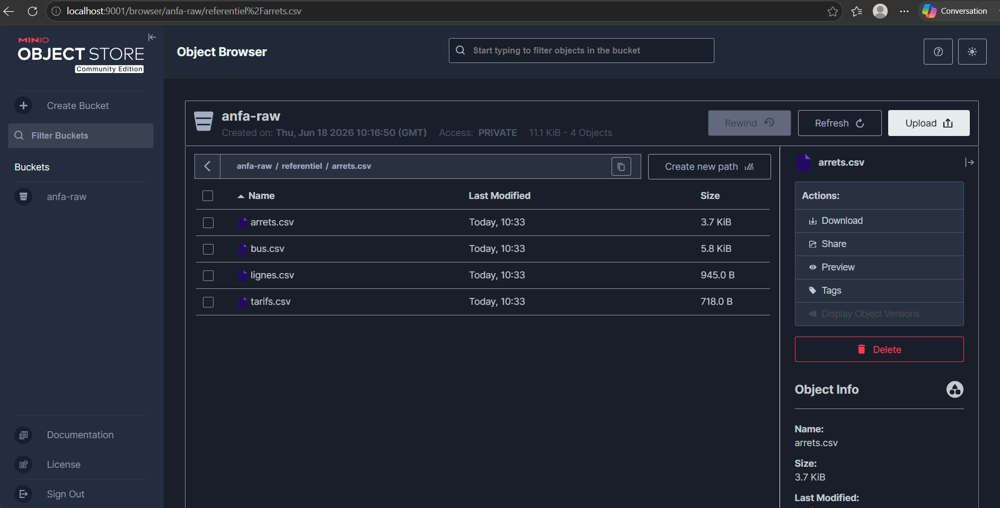

# Rendu Séance 1

**Nom et prénom :** BANIZI Gnimdou David  
**Identifiant GitHub :** BANIZI

---

## Résumé de la séance

Cette séance introduit les fondamentaux du cloud computing à travers le projet Anfa — une plateforme data pour une société de transport urbain à Lomé. Nous avons découvert les 5 caractéristiques essentielles du cloud selon le NIST, les modèles de service (IaaS, PaaS, SaaS, FaaS) et les modèles de déploiement. En pratique, nous avons déployé MinIO localement via Docker — un service de stockage objet compatible S3 — et y avons déposé le référentiel de données d'Anfa (lignes, arrêts, bus, tarifs) via un script Python utilisant boto3.

---

## Étapes principales

1. Vérification de Docker (`docker --version`)
2. Fork du dépôt `cloud-bigdata-anfa-resources` et clonage en local
3. Création de la branche `seance-01`
4. Téléchargement de l'image MinIO (`docker pull minio/minio`)
5. Lancement du conteneur MinIO avec `docker run` (ports 9000 et 9001)
6. Entrée dans le conteneur pour configurer `mc` : création du bucket `anfa-raw` et de la clé applicative `anfa-app-key`
7. Création de l'environnement virtuel Python et installation de `boto3`
8. Écriture et exécution du script `upload_referentiel.py` → les 4 CSV sont dans MinIO
9. Vérification visuelle dans la console web MinIO (http://localhost:9001)
10. Création du fichier `docker-compose.yml`
11. Commit et push de la branche `seance-01`

---

## Capture d'écran



*La capture montre les 4 fichiers CSV (arrets.csv, bus.csv, lignes.csv, tarifs.csv) dans le bucket `anfa-raw` sous le préfixe `referentiel/`.*

---

## Difficultés rencontrées

Docker Desktop n'était pas démarré au moment du premier essai, ce qui a causé une erreur de connexion au daemon Docker. Le problème a été résolu en lançant Docker Desktop et en attendant qu'il soit complètement démarré.

---

## Exercices d'application

### Exercice 1 : QCM conceptuel

**1.1** Réponse : **D — Open source obligatoire**  
Le NIST définit 5 caractéristiques du cloud : libre-service à la demande, accès réseau large, mutualisation des ressources, élasticité rapide et service mesuré. L'open source n'en fait pas partie ; c'est un choix architectural, pas une caractéristique définitoire du cloud.

**1.2** Réponse : **C — SaaS**  
Gmail est une application complète accessible via un navigateur sans aucune installation ; l'utilisateur ne gère ni serveur, ni runtime, ni mise à jour — c'est exactement la définition du Software as a Service.

**1.3** Réponse : **D — FaaS**  
Le besoin est de déclencher une fonction de vérification en quelques millisecondes à chaque événement GPS, sans serveur dédié tournant en permanence. Le FaaS répond précisément à ce cas : exécution événementielle, facturation à la milliseconde, aucun serveur à provisionner.

**1.4** Réponse : **C — Cloud hybride**  
La banque a besoin de maintenir ses données sensibles dans un environnement contrôlé (cloud privé) tout en profitant de l'élasticité du cloud public pour les analyses non sensibles. Le cloud hybride combine les deux.

**1.5** Réponse : **B — La situation où une entreprise ne peut plus changer de fournisseur sans coûts ou risques majeurs**  
Le vendor lock-in désigne la dépendance technique ou économique à un fournisseur, causée par l'usage d'API propriétaires, de formats fermés ou de services sans équivalent open source, rendant toute migration très coûteuse.

**1.6** Réponse : **C — Un service open source est forcément moins performant qu'un service managé propriétaire**  
Cette affirmation est fausse : les services managés des grands clouds sont eux-mêmes construits sur des briques open source. La performance dépend de l'architecture et des ressources allouées, pas du caractère open source ou propriétaire.

---

### Exercice 2 : Classification de services

| Service | Modèle | Justification |
|---|---|---|
| Google Compute Engine | IaaS | Fournit des machines virtuelles brutes ; l'utilisateur gère l'OS, les bibliothèques et les applications. |
| AWS Lambda | FaaS | Exécute des fonctions de code déclenchées par des événements, facturées à la milliseconde, sans serveur visible. |
| Snowflake | SaaS | Entrepôt de données entièrement managé, accessible via navigateur ou API ; l'utilisateur ne gère aucune infrastructure. |
| Heroku | PaaS | Fournit une plateforme prête à déployer des applications ; le runtime et la scalabilité sont gérés par le fournisseur. |
| Microsoft 365 | SaaS | Applications complètes accessibles via navigateur, sans installation ni gestion de serveur. |
| Databricks | PaaS | Plateforme Spark managée ; l'utilisateur écrit son code, Databricks gère le cluster et les mises à jour. |
| Azure Functions | FaaS | Exécution de fonctions événementielles, facturées à l'exécution, sans gestion de serveur. |
| Tableau Online | SaaS | Outil de visualisation entièrement hébergé et managé, accessible par URL sans installation. |

---

### Exercice 3 : Lecture et interprétation

**3.1 Commande docker run**

- `-d` : Lance le conteneur en arrière-plan (mode détaché), libérant le terminal.
- `--name analyse-anfa` : Donne le nom `analyse-anfa` au conteneur pour le retrouver facilement.
- `-p 8888:8888` : Redirige le port 8888 de la machine hôte vers le port 8888 du conteneur, rendant Jupyter accessible à http://localhost:8888.
- `-v /home/koffi/notebooks:/notebooks` : Monte le dossier local `/home/koffi/notebooks` dans le conteneur à `/notebooks` ; les notebooks sont persistés sur la machine hôte.
- `-e JUPYTER_TOKEN=anfa-token` : Définit une variable d'environnement pour sécuriser l'accès à Jupyter avec le token `anfa-token`.
- `jupyter/pyspark-notebook` : L'image Docker utilisée, qui contient Jupyter + PySpark pré-installés.

**Ce que fait la commande :** Elle lance un serveur Jupyter avec PySpark en arrière-plan, accessible sur http://localhost:8888 avec le token `anfa-token`. Les notebooks sont sauvegardés dans `/home/koffi/notebooks` sur la machine hôte, assurant leur persistance même si le conteneur est supprimé.

**3.2 Lecture du docker-compose.yml**

**a.** Le service est accessible depuis le navigateur à :
- **http://localhost:9000** → l'API S3 (utilisée par les programmes)
- **http://localhost:9001** → la console web d'administration MinIO

**b.** Les données ne sont pas perdues. Le volume `minio-data` est déclaré indépendamment du conteneur. Docker conserve ce volume même après `docker rm` ; les données persistent et sont remontées dans le nouveau conteneur au prochain `docker compose up -d`.

**c.** Le mot de passe root `MINIO_ROOT_PASSWORD: secret` est trop faible et stocké en clair dans le fichier YAML versionné. En production, il faudrait utiliser un gestionnaire de secrets et ne jamais commiter des credentials dans Git.

---

### Exercice 4 : Diagnostic

**a.** Le script utilise `aws_access_key_id="anfa-admin"` et `aws_secret_access_key="anfa-password-2026"`, qui sont les identifiants root de la console MinIO. L'API S3 de MinIO n'accepte pas les identifiants root pour les opérations programmatiques — elle attend les clés applicatives créées avec `mc admin user svcacct add`.

**b.** Correction du code :
```python
s3 = boto3.client(
    "s3",
    endpoint_url="http://localhost:9000",
    aws_access_key_id="anfa-app-key",
    aws_secret_access_key="anfa-app-secret-2026",
    region_name="us-east-1",
)
```

**c.** La console web (port 9001) utilise un protocole d'authentification propre à l'interface d'administration. L'API S3 (port 9000) implémente le protocole AWS Signature V4 qui authentifie via des access key / secret key dédiées. Les identifiants root sont réservés à l'administration ; les opérations sur les objets doivent passer par des comptes de service — c'est une bonne pratique de sécurité fondamentale.

---

### Exercice 5 : Mini-cas d'architecture

**a. Deux limites de l'architecture actuelle :**

1. **Pas de temps réel :** L'export CSV est mensuel ; impossible de produire des prédictions horaires avec des données vieilles d'un mois.
2. **Single Point of Failure :** Le modèle tourne sur le PC de Toyi — si la machine est éteinte ou tombe en panne, plus aucune prédiction n'est disponible. Les analystes ne peuvent pas accéder aux résultats sans lui.

**b. Besoins → caractéristiques NIST :**

| Besoin | Caractéristique NIST | Explication |
|---|---|---|
| Prédictions toutes les heures | Élasticité rapide | Le système déclenche des calculs à la demande sans provisionner manuellement des ressources. |
| Tableau de bord partagé sans installation | Accès réseau large | Tous les analystes accèdent au dashboard depuis n'importe quel terminal via une URL. |
| Augmenter la capacité lors des pics | Élasticité rapide | La plateforme scale automatiquement pendant les pics puis réduit les ressources après. |
| Maîtriser les coûts | Service mesuré (pay-as-you-go) | On ne paie que les ressources réellement consommées. |
| Données clients dans un environnement contrôlé | Mutualisation des ressources (isolation) | Le cloud privé assure que les données sont isolées des autres tenants. |

**c. Modèles de service :**

- **(i) Tableau de bord → SaaS** : les analystes accèdent à l'outil via navigateur sans aucune installation ni gestion de serveur.
- **(ii) Calcul des prédictions → PaaS** : Toyi dépose son code, la plateforme gère l'orchestration et l'exécution horaire automatique.
- **(iii) Stockage des données clients → IaaS** avec stockage objet privé : contrôle maximal sur l'emplacement physique des données pour la conformité.

**d. Modèle de déploiement recommandé : Cloud hybride**  
Les données clients sensibles restent dans un cloud privé on-premise pour la conformité réglementaire. Les calculs analytiques sur données agrégées profitent de l'élasticité du cloud public lors des pics. Le cloud hybride permet cette séparation claire avec une connectivité sécurisée entre les deux environnements.

**e. Trois stratégies contre le vendor lock-in :**

1. **Conteneuriser avec Docker** : le modèle empaqueté dans un conteneur tourne à l'identique sur AWS, GCP, Azure ou on-premise.
2. **Utiliser des outils open source** : Apache Kafka, Apache Airflow, MinIO — des standards portables entre fournisseurs.
3. **Architecturer en services découplés via des interfaces standard** : si chaque composant communique via HTTP, S3 ou SQL, il peut être remplacé ou migré indépendamment.