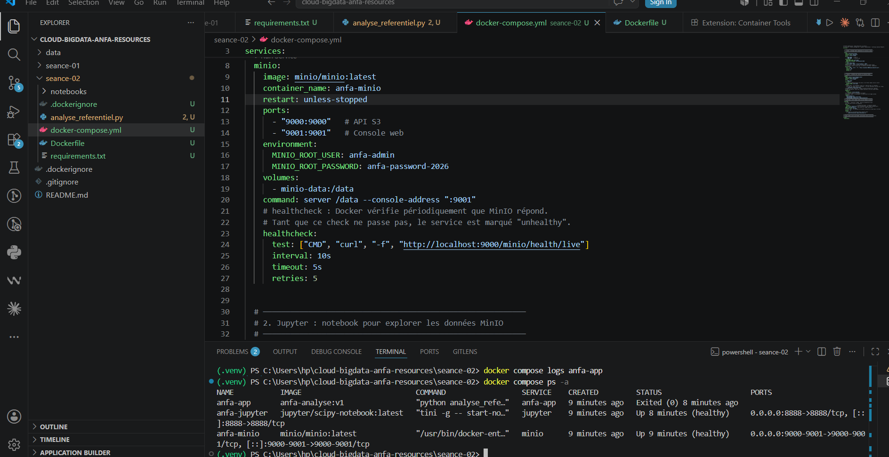
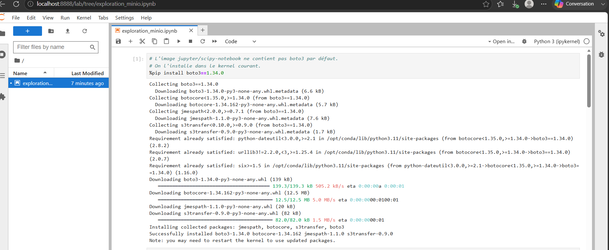
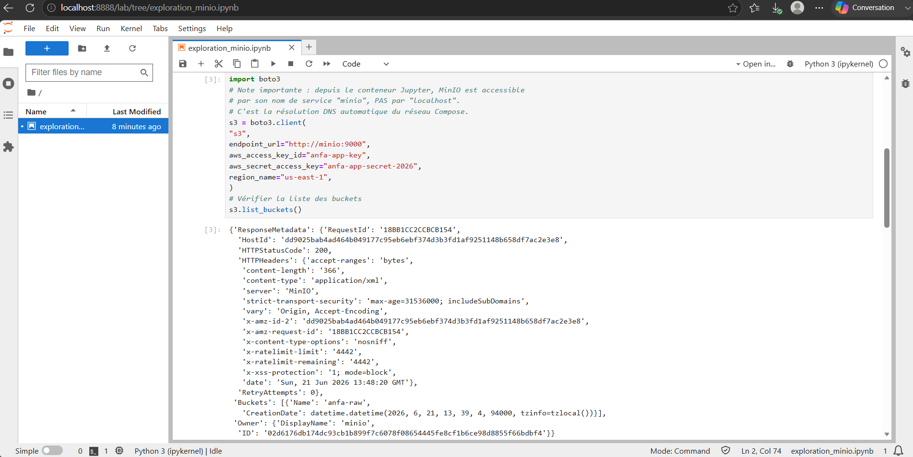
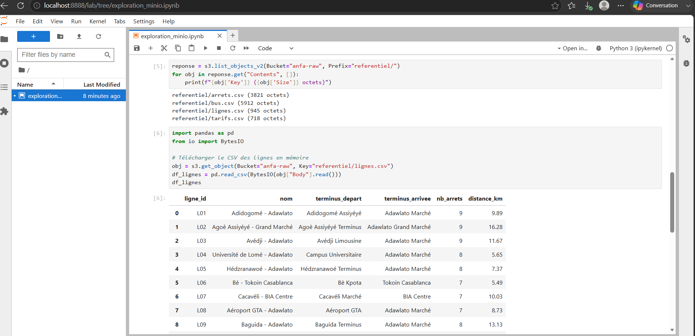
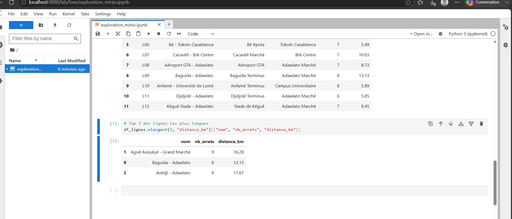

# Rendu - Séance 2

**Nom et prénom : ** BANIZI Gnimdou David
**Identifiant GitHub : ** BANIZI
**Date de soumission : ** 21/06/2026

---

## Résumé de la séance
Durant cette séance, j'ai écrit mon premier Dockerfile pour conteneuriser
un script PySpark analysant le référentiel Anfa. J'ai construit l'image
Docker, observé le mécanisme de cache, puis orchestré un stack à 3 services
(MinIO + Jupyter + image custom) avec Docker Compose. Enfin, j'ai exploré
les données du bucket anfa-raw depuis un notebook Jupyter via boto3 et pandas.

## Étapes principales
1. Écriture du Dockerfile et construction de l'image `anfa-analyse:v1` (taille observée : 1.17 Go).
2. Mise en place du `.dockerignore` et observation du cache de Docker.
3. Écriture du `docker-compose.yml` orchestrant MinIO, Jupyter, et l'image custom.
4. Création du notebook `exploration_minio.ipynb` qui lit les données depuis MinIO via boto3 et pandas.

## Captures d'écran

### docker compose ps


### Notebook Jupyter





## Bonus multi-stage (optionnel)
Réalisé. Construction de l'image avec `Dockerfile.multistage` (build en 2 étapes).
- Image v1 (standard) : 1.17 GB
- Image v2-multistage : 1.17 GB
- Gain : 0 MB — résultat attendu pour PySpark qui dépend de Java.
  Le gain multi-stage est spectaculaire pour des apps compilées (Go, Rust)
  mais limité ici car Java reste nécessaire dans les deux étapes.

## Réponses aux exercices d'application

### Exercice 1 : QCM conceptuel

**1.1 — Réponse : C**
Un conteneur partage le noyau de la machine hôte, contrairement à une VM qui embarque son propre noyau.

**1.2 — Réponse : B**
L'image est un modèle figé en lecture seule ; le conteneur est une instance en cours d'exécution de cette image.

**1.3 — Réponse : B**
Docker s'appuie sur les namespaces du noyau Linux pour isoler les processus, le réseau, le système de fichiers et les utilisateurs de chaque conteneur.

**1.4 — Réponse : A**
Docker utilise les cgroups (control groups) pour limiter et contrôler les ressources (CPU, mémoire, I/O) consommées par un conteneur.

**1.5 — Réponse : B**
Sous macOS, Docker s'exécute dans une machine virtuelle Linux légère et invisible gérée par Docker Desktop, car macOS ne possède pas de noyau Linux natif.

**1.6 — Réponse : B**
DotCloud est la société d'origine qui a créé Docker et l'a rendu open-source en 2013, avant de se renommer Docker Inc.

**1.7 — Réponse : C**
Docker a apporté un format d'image portable, une CLI simple et un registre public (Docker Hub), en s'appuyant sur les mêmes primitives noyau que LXC.

**1.8 — Réponse : B**
OCI signifie Open Container Initiative — une norme ouverte qui définit les spécifications pour les images et les runtimes de conteneurs.

---

### Exercice 2 : Lecture et analyse d'un Dockerfile

```dockerfile
FROM python:3.11
WORKDIR /application
COPY . /application
RUN pip install -r requirements.txt
EXPOSE 5000
CMD ["python", "main.py"]
```

**2.1 — Explication de chaque instruction**

- `FROM python:3.11` : définit l'image de base à utiliser, ici Python 3.11 officielle.
- `WORKDIR /application` : définit le répertoire de travail dans le conteneur ; toutes les instructions suivantes s'exécutent depuis ce dossier.
- `COPY . /application` : copie tout le contenu du dossier local (contexte de build) dans `/application` dans le conteneur.
- `RUN pip install -r requirements.txt` : installe les dépendances Python listées dans `requirements.txt`.
- `EXPOSE 5000` : documente que le conteneur écoute sur le port 5000, mais n'ouvre pas réellement le port.
- `CMD ["python", "main.py"]` : définit la commande par défaut exécutée au démarrage du conteneur.

**2.2 — EXPOSE vs -p**

`EXPOSE 5000` est une simple documentation dans le Dockerfile : il indique que l'application écoute sur le port 5000, mais ne publie pas ce port sur la machine hôte. L'option `-p 5000:5000` de `docker run` publie réellement le port du conteneur sur la machine hôte, rendant l'application accessible depuis l'extérieur.

**2.3 — Deux problèmes**

- **Problème 1 — Image de base trop lourde** : `python:3.11` est l'image complète qui pèse plus de 1 Go. Il faudrait utiliser `python:3.11-slim-bookworm` qui est beaucoup plus légère (~150 Mo).

- **Problème 2 — Mauvais ordre des instructions (cache)** : `COPY . /application` est placé avant `RUN pip install`, donc à chaque modification du code, pip install est relancé inutilement. Il faut d'abord copier uniquement `requirements.txt`, installer les dépendances, puis copier le reste du code.

**2.4 — Version corrigée**

```dockerfile
FROM python:3.11-slim-bookworm

ENV PYTHONDONTWRITEBYTECODE=1 \
    PYTHONUNBUFFERED=1

WORKDIR /application

# Copier uniquement requirements.txt pour profiter du cache
COPY requirements.txt .
RUN pip install --no-cache-dir -r requirements.txt

# Copier le code après l'installation des dépendances
COPY . .

# Créer un utilisateur non-root pour la sécurité
RUN useradd -m appuser
USER appuser

EXPOSE 5000
CMD ["python", "main.py"]
```

---

### Exercice 3 : Diagnostic

**3.1 — Le build qui échoue**

a. **Cause précise** : Le fichier `requirements.txt` n'a pas encore été copié dans le conteneur au moment où `RUN pip install` est exécuté. L'instruction `COPY . .` est placée après le `RUN`, donc le fichier n'existe pas encore dans le système de fichiers du conteneur.

b. **Correction** :
```dockerfile
FROM python:3.11-slim
WORKDIR /app
COPY requirements.txt .
RUN pip install -r requirements.txt
COPY . .
CMD ["python", "main.py"]
```

c. **Explication** : Cette erreur illustre une mauvaise compréhension du fait que chaque instruction Docker s'exécute dans un environnement isolé et séquentiel — le conteneur ne voit que ce qui a été explicitement copié avant l'instruction en cours ; les fichiers locaux ne sont pas automatiquement disponibles.

**3.2 — Le conteneur qui ne voit pas l'autre**

a. **Erreur** : Le `DATABASE_URL` utilise `localhost` pour pointer vers la base de données. Dans Docker Compose, `localhost` désigne le conteneur lui-même, pas le service `db`.

b. **Correction** : Remplacer `localhost` par le nom du service Docker Compose : DATABASE_URL: "postgresql://user:password@db:5432/anfa"

---

### Exercice 4 : Optimisation d'image

**a. Quatre problèmes identifiés**

1. **Image de base trop lourde** : `ubuntu:22.04` est une image généraliste très lourde ; une image `python:3.11-slim` serait bien plus adaptée et légère.
2. **Plusieurs RUN séparés** : Chaque `RUN apt-get` crée une couche Docker supplémentaire ; il faut les regrouper en un seul `RUN` pour réduire la taille de l'image.
3. **Outils inutiles installés** : `git`, `build-essential`, `wget` ne sont pas nécessaires à l'exécution ; ils gonflent l'image inutilement.
4. **Mauvais ordre des instructions** : `COPY . /app` est placé avant `RUN pip install`, ce qui invalide le cache à chaque modification du code et force la réinstallation des dépendances.

**b. Version optimisée**

```dockerfile
# Image de base légère avec Python déjà installé
FROM python:3.11-slim-bookworm

# Éviter les fichiers .pyc et forcer les logs en temps réel
ENV PYTHONDONTWRITEBYTECODE=1 \
    PYTHONUNBUFFERED=1

# Installer uniquement curl si nécessaire, en nettoyant le cache apt
RUN apt-get update && \
    apt-get install -y --no-install-recommends curl && \
    rm -rf /var/lib/apt/lists/*

WORKDIR /app

# Copier requirements.txt en premier pour profiter du cache Docker
COPY requirements.txt .
RUN pip install --no-cache-dir -r requirements.txt

# Copier le code après les dépendances
COPY . .

# Utilisateur non-root pour la sécurité
RUN useradd -m appuser
USER appuser

CMD ["python3", "downloader.py"]
```

---

### Exercice 5 : Mini-cas d'architecture

**a. Services à conteneuriser**

- `ftp-ingestion` : script Python qui lit les fichiers GPS depuis le FTP, les nettoie et écrit les résultats agrégés dans MinIO.
- `minio` : stockage objet compatible S3 qui stocke les données brutes et agrégées.
- `jupyter` : notebook pour explorer les données stockées dans MinIO et créer des graphiques.

**b. Restart policy pour le script FTP**

Je choisirais `no`. Le script s'exécute une fois par nuit (tâche batch) et doit se terminer proprement après son exécution ; une politique `unless-stopped` ou `always` le relancerait en boucle indéfiniment, ce qui n'est pas le comportement souhaité pour un traitement ponctuel.

**c. Passer la date au script**

- **Mécanisme 1 — Variable d'environnement** : passer la date via `environment: DATE_TRAITEMENT=2026-06-21` dans le `docker-compose.yml` ou avec `-e DATE_TRAITEMENT=2026-06-21` dans `docker run`.
- **Mécanisme 2 — Argument de commande** : surcharger le `command:` dans le `docker-compose.yml` avec `command: python pipeline.py --date 2026-06-21`.

**Recommandation** : la variable d'environnement, car elle ne nécessite pas de modifier la signature du script et est plus facilement paramétrable dans un outil d'orchestration.

**d. Pourquoi un conteneur séparé pour le script ?**

Mettre le script dans le conteneur Jupyter mélangerait deux responsabilités distinctes : l'exploration interactive des données et l'exécution automatisée du pipeline. Cela viole le principe de séparation des responsabilités (un conteneur = un rôle). De plus, le conteneur Jupyter tourne en permanence alors que le script batch doit s'exécuter et se terminer ; les gérer ensemble rendrait la supervision, les logs et les redémarrages bien plus complexes.

**e. Squelette docker-compose.yml**

```yaml
services:

  minio:
    image: minio/minio:latest
    ports:
      - "9000:9000"
      - "9001:9001"
    environment:
      MINIO_ROOT_USER: anfa-admin
      MINIO_ROOT_PASSWORD: anfa-password-2026
    volumes:
      - minio-data:/data
    command: server /data --console-address ":9001"
    healthcheck:
      test: ["CMD", "curl", "-f", "http://localhost:9000/minio/health/live"]
      interval: 10s
      timeout: 5s
      retries: 5

  ftp-ingestion:
    build: ./ftp-ingestion
    restart: "no"
    environment:
      DATE_TRAITEMENT: "2026-06-21"
      MINIO_ENDPOINT: "http://minio:9000"
    depends_on:
      minio:
        condition: service_healthy

  jupyter:
    image: jupyter/scipy-notebook:latest
    ports:
      - "8888:8888"
    environment:
      JUPYTER_TOKEN: anfa-token
    volumes:
      - ./notebooks:/home/jovyan/work
    depends_on:
      minio:
        condition: service_healthy

volumes:
  minio-data:
```

## Difficultés rencontrées
- Conflit de nom de conteneur `anfa-minio` entre la séance 1 et la séance 2 : résolu avec `docker rm -f anfa-minio`.
- Le bucket MinIO et la clé applicative ont dû être recréés via `mc` dans le terminal car le volume était neuf.