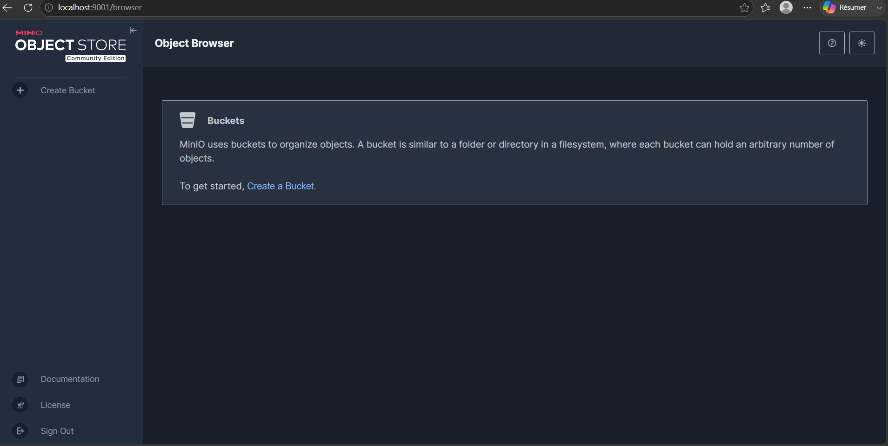
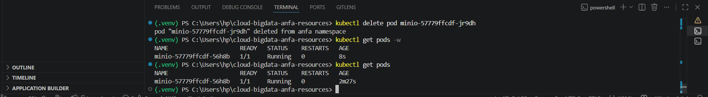
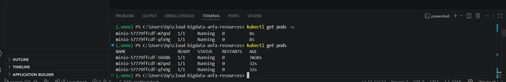

# Rendu Séance 3

**Nom et prénom :** BANIZI Gnimdou David
**Identifiant GitHub :** BANIZI
**Date de soumission :** 25/06/2026

---

## Résumé de la séance
Kind a été installé et un cluster Kubernetes local nommé "anfa" a été créé 
avec un nœud unique faisant office de Control Plane et Worker. Le namespace 
"anfa" a été configuré comme espace de travail par défaut. MinIO a été déployé 
via 3 manifestes YAML (PVC, Deployment, Service). Le self-healing a été observé 
après suppression manuelle d'un pod : Kubernetes l'a recréé automatiquement en 
moins de 10 secondes. Le scaling de 1 à 3 replicas puis retour à 1 a été testé 
avec succès. L'Ingress Controller nginx a été activé et est opérationnel.

## Étapes principales
1. Installation de Kind v0.32.0 et kubectl v1.34.1, création du cluster `anfa`.
2. Création du namespace `anfa` et configuration de kubectl par défaut.
3. Déploiement de MinIO via 3 manifestes YAML (PVC, Deployment, Service).
4. Observation du self-healing après suppression manuelle du pod `minio-57779ffcdf-jr9dh`.
5. Scaling du Deployment de 1 à 3 replicas, puis retour à 1.
6. Activation de l'Ingress Controller nginx dans le namespace `ingress-nginx`.

## Captures d'écran

### Console MinIO accessible via port-forward


### Self-healing observé


### Scaling à 3 replicas


## Réponses aux exercices d'application

### Exercice 1 : QCM conceptuel

**1.1 → B**
Kubernetes orchestre des conteneurs sur un cluster de machines, en s'appuyant sur un container runtime (containerd, Docker, CRI-O). Il ne remplace pas Docker mais l'utilise comme runtime.

**1.2 → B**
etcd est la base de données clé-valeur distribuée qui stocke l'état complet du cluster (tous les objets, configurations, statuts).

**1.3 → C**
Le Scheduler analyse les ressources disponibles sur chaque nœud et décide sur lequel placer chaque nouveau pod.

**1.4 → C**
kubectl parle à l'API Server, qui est le point d'entrée unique du cluster ; c'est lui qui consulte ensuite etcd.

**1.5 → B**
Le Deployment détecte que l'état observé (0 replica) diverge de l'état souhaité (1 replica) et recrée immédiatement un nouveau pod — c'est le self-healing observé en TP.

**1.6 → B**
NodePort expose le service sur un port statique de chaque nœud du cluster, permettant l'accès depuis l'extérieur sans load balancer cloud.

**1.7 → B**
Elle modifie l'état souhaité du Deployment à 5 replicas ; le Controller Manager converge ensuite vers ce nombre en créant ou supprimant des pods.

**1.8 → B**
Un Namespace isole logiquement les ressources, permettant de séparer les environnements (dev, prod) ou les équipes dans un même cluster.

**1.9 → B**
Avec Kind, chaque nœud Kubernetes est en réalité un conteneur Docker — observé avec `docker ps` qui montrait `anfa-control-plane`.

---

### Exercice 2 : Lecture et interprétation d'un manifeste

**2.1**
`selector.matchLabels` indique au Deployment quels pods il doit gérer : il cherche les pods dont les labels correspondent à `app: anfa-api`. Le champ `template.metadata.labels` doit obligatoirement avoir les mêmes valeurs, sinon le Deployment ne reconnaîtrait pas ses propres pods et tournerait en boucle en en créant indéfiniment.

**2.2**
2 pods seront créés (champ `replicas: 2`). Si l'un meurt, le Controller Manager détecte que l'état observé (1 replica) diverge de l'état souhaité (2 replicas) et recrée automatiquement un nouveau pod pour revenir à 2.

**2.3**
`minio` est le nom du Service Kubernetes qui expose MinIO. La résolution est rendue possible par CoreDNS, le DNS interne de Kubernetes : chaque Service crée automatiquement une entrée DNS de la forme `<nom-service>.<namespace>.svc.cluster.local`, accessible en forme courte `minio` depuis les pods du même namespace. On utilise le nom plutôt qu'une IP car les IPs des pods changent à chaque recréation.

**2.4**
Sans Service, l'API est inaccessible depuis l'extérieur du pod. Les autres pods du cluster ne peuvent pas non plus la joindre de façon stable car les pods n'ont pas d'adresse IP fixe. Il est impossible d'appeler cette API depuis une application mobile ou un autre service.

**2.5**
```yaml
apiVersion: v1
kind: Service
metadata:
  name: anfa-api
  namespace: anfa
spec:
  type: ClusterIP
  selector:
    app: anfa-api
  ports:
    - name: http
      port: 80
      targetPort: 8000
```

---

### Exercice 3 : Diagnostic

**3.1 — Le pod qui ne démarre pas**

a. `ImagePullBackOff` signifie que Kubernetes n'a pas réussi à télécharger l'image Docker spécifiée depuis le registry. Il réessaie avec un délai croissant (backoff).

b. La cause est une faute de frappe dans le nom de l'image : `minio/miniooo:latest` n'existe pas sur Docker Hub. Le nom correct est `minio/minio:latest`.

c. `kubectl describe pod minio-7d9f8b6c5-x2k9p` — la section `Events` en bas affichera le message d'erreur exact du registry.

**3.2 — Le PVC qui ne se lie pas**

a. `Pending` signifie que Kubernetes n'a pas encore trouvé de PersistentVolume disponible pour satisfaire la demande du PVC.

b. La cause la plus probable est que `500Gi` dépasse largement la capacité disponible sur un cluster Kind local. Kind utilise le stockage du disque local de la machine hôte, qui ne peut généralement pas fournir 500 Go.

c. `kubectl describe pvc data-pvc` — la section `Events` indiquera `no persistent volumes available for this claim` ou un message similaire.

**3.3 — Le port-forward qui échoue**

a. L'erreur apparaît car `kubectl port-forward` a besoin d'un pod `Running` pour établir le tunnel réseau. Si le pod est en `Pending`, il n'existe pas encore vraiment et aucune connexion n'est possible.

b. `kubectl describe pod <nom-du-pod>` pour voir les événements, ou `kubectl get events` pour voir tous les événements du namespace.

c. L'ordre logique est : appliquer le PVC → appliquer le Deployment → attendre que le pod soit `Running` (`kubectl get pods -w`) → appliquer le Service → lancer `kubectl port-forward`.

---

### Exercice 4 : De Docker Compose à Kubernetes

**4.1**
Il faut 3 manifestes Kubernetes distincts :
- `minio-pvc.yaml` (PersistentVolumeClaim) : demande de stockage persistant, équivalent du volume nommé `minio-data`.
- `minio-deployment.yaml` (Deployment) : décrit le pod MinIO, son image, ses variables d'environnement et monte le PVC.
- `minio-service.yaml` (Service) : expose MinIO sur le réseau, équivalent du mapping de ports `9000:9000` et `9001:9001`.

**4.2**
Un volume Docker nommé est géré localement par le daemon Docker sur la machine hôte : il est simple, implicite et lié à cette machine. Un PersistentVolumeClaim Kubernetes est une demande de stockage abstraite et découplée : le PVC décrit le besoin (taille, mode d'accès) sans savoir où ni comment le stockage sera fourni. C'est le cluster qui trouve ou crée le PersistentVolume correspondant via un StorageClass, ce qui permet de changer le backend de stockage (SSD local, NFS, cloud) sans modifier les manifestes applicatifs.

**4.3**
Avec Docker Compose, le port est directement mappé sur l'hôte (`9001:9001`), donc `localhost:9001` fonctionne immédiatement. Avec Kind, le NodePort est exposé sur le nœud Kubernetes qui est lui-même un conteneur Docker isolé du réseau hôte — d'où la nécessité du `kubectl port-forward` pour créer un tunnel. Pour un accès direct comme avec Compose, il faudrait configurer Kind avec `extraPortMappings` dans un fichier de configuration de cluster, ou utiliser un vrai cluster avec un LoadBalancer cloud.

**4.4**
Deux apports concrets observés en TP :
- **Le self-healing** : quand on a supprimé le pod MinIO manuellement, Kubernetes l'a recréé automatiquement en moins de 10 secondes, sans aucune intervention. Avec Docker Compose, le conteneur serait resté mort.
- **Le scaling horizontal** : en une seule commande (`kubectl scale --replicas=3`), on est passé de 1 à 3 instances de MinIO instantanément, avec convergence automatique vers l'état souhaité.

---

### Exercice 5 : Mini-cas d'architecture

**5.1**
- `pipeline-anfa` → **CronJob** : c'est une tâche planifiée qui tourne chaque nuit à 2h du matin, s'exécute pendant ~15 minutes puis se termine, ce qui correspond exactement au rôle d'un CronJob (équivalent Kubernetes du cron Linux).
- `anfa-api` → **Deployment** : c'est une API REST qui doit être en permanence disponible avec plusieurs replicas, sans état persistant propre, ce qui correspond parfaitement au Deployment.
- `anfa-dashboard` → **Deployment** : Grafana est une application web sans état persistant critique qui doit rester disponible en journée, un Deployment avec 1 ou 2 replicas suffit.

**5.2**
```yaml
minReplicas: 2
maxReplicas: 10
metric: CPU à 60%
```
Le minimum de 2 replicas garantit la haute disponibilité en permanence (si un pod tombe, l'autre prend le relais). Le maximum de 10 couvre les pics à 50 req/s aux heures de pointe. La cible CPU à 60% laisse une marge avant saturation pour absorber les pics soudains sans attendre que les pods soient déjà surchargés.

**5.3**
**LoadBalancer** — car `anfa-api` est exposée aux applications mobiles des conducteurs, donc accessible depuis Internet. Sur un cluster managé chez un fournisseur cloud (AWS, GCP, Azure), le type LoadBalancer provisionne automatiquement un load balancer cloud avec une IP publique stable, ce qui est la solution appropriée pour une API en production.

**5.4**
Kubernetes utilise par défaut la stratégie **RollingUpdate** : lors d'une mise à jour du Deployment, il ne supprime pas tous les pods d'un coup. Il crée d'abord un nouveau pod avec la nouvelle version, attend qu'il soit `Ready`, puis supprime un ancien pod, et ainsi de suite. À aucun moment tous les pods ne sont indisponibles simultanément. Les paramètres `maxUnavailable` (par défaut 25%) et `maxSurge` (par défaut 25%) contrôlent le rythme. Le Service continue d'envoyer le trafic uniquement vers les pods `Ready`, garantissant zéro coupure perceptible pour les utilisateurs.

**5.5**
```yaml
apiVersion: apps/v1
kind: Deployment
metadata:
  name: anfa-api
  namespace: anfa
spec:
  replicas: 3
  selector:
    matchLabels:
      app: anfa-api
  template:
    metadata:
      labels:
        app: anfa-api
    spec:
      containers:
        - name: api
          image: anfa/api:v1
          ports:
            - containerPort: 8000
          env:
            - name: MINIO_ENDPOINT
              value: "http://minio:9000"
```

---

## Difficultés rencontrées
- Le PATH de Kind et kubectl n'était pas rechargé automatiquement après 
installation sur Windows : résolu en rechargeant manuellement le PATH avec 
`[System.Environment]::GetEnvironmentVariable`.
- Le PVC est resté en `Pending` jusqu'à l'application du Deployment : 
comportement normal avec Kind qui provisionne les volumes à la demande.