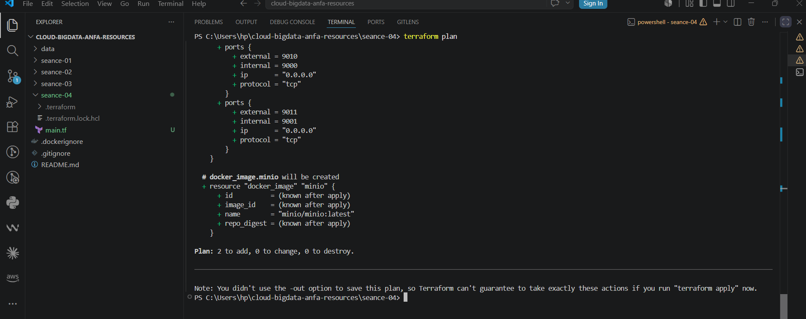
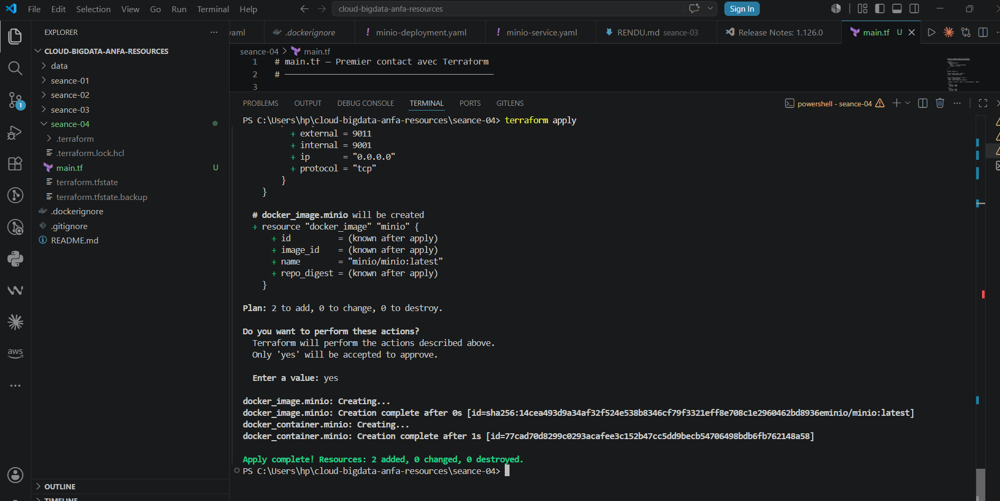
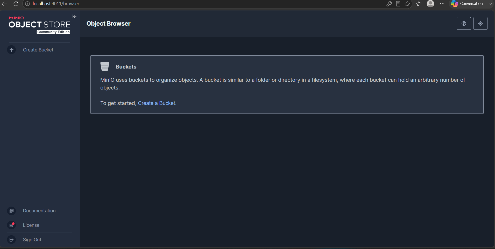
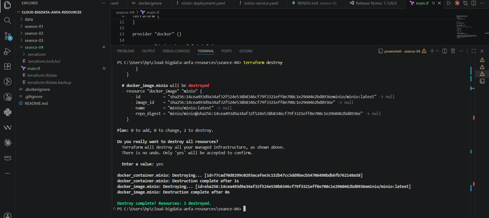

# Rendu — Séance 4

**Nom et prénom :** BANIZI Gnimdou David
**Identifiant GitHub :** BANIZI
**Date de soumission :** 27/06/2026

---

## Résumé de la séance

Terraform a été installé et le workflow fondamental init → plan → apply → destroy a été
maîtrisé. Une infrastructure Docker complète (réseau, volume, conteneur MinIO) a été
décrite en HCL et appliquée via Terraform. Le rôle du state Terraform et l'importance
de ne jamais le committer ont été compris. Le code a été refactorisé avec des variables
et un fichier `.tfvars` pour le rendre propre et réutilisable. Les changements incrémentaux
ont été observés concrètement.

---

## Étapes principales

1. Installation de Terraform v1.15.7 et premier `main.tf` minimal.
2. Maîtrise du workflow `init` → `plan` → `apply` → `destroy`.
3. Compréhension du state Terraform et bonnes pratiques de versioning (`.gitignore`).
4. Stack complète : réseau `anfa-network`, volume `anfa-minio-data-tf`, conteneur MinIO.
5. Refactoring en variables (`variables.tf`) et fichier `terraform.tfvars`.

---

## Captures d'écran

### terraform plan (création initiale)


### terraform apply réussi


### Console MinIO créée par Terraform


### terraform destroy


---

## Réponses aux exercices d'application

---

### Exercice 1 — QCM conceptuel

**1.1** Réponse : **B**

L'IaC ne remplace pas la nécessité de comprendre l'infrastructure sous-jacente ; elle automatise sa description et son provisioning, mais un praticien doit toujours savoir ce qu'il décrit.

**1.2** Réponse : **B**

Le déclaratif décrit l'état final souhaité (« je veux un conteneur avec ce port ») et laisse l'outil calculer les actions ; l'impératif impose à l'utilisateur d'écrire chaque étape à exécuter dans l'ordre.

**1.3** Réponse : **B**

Une opération idempotente produit toujours le même résultat, qu'on l'applique une fois ou dix fois ; si l'état souhaité est déjà atteint, l'outil ne fait rien.

**1.4** Réponse : **B**

Un provider est un plugin Terraform qui implémente la communication avec une API spécifique (AWS, Docker, Kubernetes, etc.) ; sans provider, Terraform ne sait pas interagir avec quoi que ce soit.

**1.5** Réponse : **B**

Terraform compare le state existant au code ; ne voyant aucun écart, il n'effectue aucune action (comportement idempotent).

**1.6** Réponse : **C**

Le fichier `terraform.tfstate` mémorise ce que Terraform a créé et la configuration actuelle de chaque resource, ce qui lui permet de calculer uniquement les changements incrémentaux lors des apply suivants.

**1.7** Réponse : **B**

Le fichier `terraform.tfstate` peut contenir des secrets en clair (mots de passe, clés API) et sa corruption par des commits concurrents peut rendre l'infrastructure ingérable ; il ne doit jamais être versionné dans Git.

**1.8** Réponse : **C**

`terraform plan` prévisualise les changements qui seront appliqués sans modifier l'infrastructure ; c'est la commande de sécurité fondamentale à exécuter avant tout `apply`.

**1.9** Réponse : **B**

OpenTofu est un fork open source 100 % compatible de Terraform, créé par la Linux Foundation après que HashiCorp a changé la licence de Terraform de MPL vers BSL en août 2023.

**1.10** Réponse : **B**

Terraform et Ansible sont complémentaires : Terraform provisionne l'infrastructure (crée les VM, réseaux, conteneurs…), tandis qu'Ansible configure des machines existantes (installe des paquets, modifie des fichiers…).

---

### Exercice 2 — Lecture et interprétation d'un fichier Terraform

#### 2.1 — Les 4 resources définies

| Resource | Type | Rôle |
|---|---|---|
| `docker_network.back` | `docker_network` | Crée un réseau Docker nommé `anfa-backend` pour isoler et faire communiquer les conteneurs. |
| `docker_volume.data` | `docker_volume` | Crée un volume Docker nommé `postgres-data` pour persister les données de la base PostgreSQL. |
| `docker_image.postgres` | `docker_image` | Télécharge (pull) l'image Docker `postgres:15` depuis le registre. |
| `docker_container.db` | `docker_container` | Lance le conteneur PostgreSQL en le connectant à l'image, au volume et au réseau définis ci-dessus. |

#### 2.2 — La référence `docker_image.postgres.image_id`

`docker_image.postgres.image_id` est une **référence inter-resources** : elle pointe vers l'attribut `image_id` de la resource `docker_image` nommée `postgres`. Cela signifie que Terraform utilisera l'ID précis de l'image après qu'elle ait été téléchargée.

Par rapport à écrire `image = "postgres:15"` directement, cette référence apporte deux avantages :

- **Dépendance implicite** : Terraform sait qu'il doit créer `docker_image.postgres` *avant* `docker_container.db`, garantissant l'ordre de création correct.
- **Exactitude** : on utilise l'ID de digest réel de l'image (SHA256) plutôt que le tag muable `postgres:15`, ce qui évite des divergences si le tag est mis à jour.

#### 2.3 — Ordre de création lors du premier `terraform apply`

Terraform analyse le graphe de dépendances et crée les resources dans cet ordre :

1. `docker_network.back` — aucune dépendance
2. `docker_volume.data` — aucune dépendance (peut être parallèle à l'étape 1)
3. `docker_image.postgres` — aucune dépendance (peut être parallèle aux étapes 1 et 2)
4. `docker_container.db` — dépend des trois resources précédentes (`docker_image.postgres.image_id`, `docker_volume.data.name`, `docker_network.back.name`)

Les trois premières resources peuvent être créées en parallèle ; le conteneur est obligatoirement le dernier car il référence toutes les autres.

#### 2.4 — Problème de sécurité et correction

Le problème principal est que le mot de passe PostgreSQL `secret123` est écrit **en clair dans le code source**. Si ce fichier est commité dans Git, le secret est exposé dans tout l'historique.

**Correction concrète** — utiliser une variable `sensitive` :

```hcl
# variables.tf
variable "postgres_password" {
  type        = string
  description = "Mot de passe administrateur PostgreSQL"
  sensitive   = true
}

# main.tf — remplacer la ligne dans env
env = [
  "POSTGRES_DB=anfa",
  "POSTGRES_USER=anfa_user",
  "POSTGRES_PASSWORD=${var.postgres_password}",
]
```

```hcl
# terraform.tfvars (ajouté au .gitignore !)
postgres_password = "secret123"
```

Ainsi, le secret n'apparaît jamais dans le code versionné ni dans les logs Terraform (grâce à `sensitive = true`).

#### 2.5 — Comportement de Terraform après `destroy` + modification du port externe

Après `terraform destroy`, l'infrastructure n'existe plus. Lorsque l'étudiant relance `terraform apply` avec `external = 5433` :

Terraform va **recréer l'intégralité de l'infrastructure** (réseau, volume, image, conteneur), car tout a été détruit. Pour le conteneur, il utilisera directement `external = 5433` ; aucune comparaison avec un état précédent n'est possible puisque le state a été vidé par `destroy`. Le port externe du conteneur PostgreSQL sera donc `5433` au lieu de `5432`.

---

### Exercice 3 — Diagnostic

#### 3.1 — L'apply qui échoue avec une dépendance circulaire

**a. Signification de l'erreur**

L'erreur `Cycle: docker_container.a, docker_container.b` signifie que Terraform a détecté un **cycle** dans le graphe de dépendances : la resource `a` dépend de `b` (via `${docker_container.b.name}`), et `b` dépend de `a` (via `${docker_container.a.name}`). Il est impossible de déterminer laquelle créer en premier.

**b. Pourquoi Terraform refuse**

Terraform construit un graphe orienté acyclique (DAG) pour ordonner la création des resources. Un cycle brise cette propriété : pour créer `a`, il faudrait que `b` existe déjà, mais pour créer `b`, il faudrait que `a` existe déjà. Terraform ne peut pas résoudre cet ordre, donc il refuse d'appliquer le code.

**c. Solution proposée**

Il faut briser la dépendance circulaire en passant le nom de l'un des conteneurs comme valeur statique plutôt que comme référence dynamique :

```hcl
resource "docker_container" "a" {
  name  = "container-a"
  image = "alpine"
  env   = ["LINKED_TO=container-b"]  # valeur statique, pas de référence
}

resource "docker_container" "b" {
  name  = "container-b"
  image = "alpine"
  env   = ["LINKED_TO=${docker_container.a.name}"]  # b dépend de a seulement
}
```

Terraform peut alors créer `a` en premier, puis `b`.

---

#### 3.2 — Le plan qui veut tout recréer

**a. Pourquoi `-/+` (destroy + recreate) plutôt que `~` (update in-place) ?**

Certains attributs d'un `docker_container` sont **immuables** : le provider Docker ne peut pas modifier la liste des variables d'environnement d'un conteneur existant sans le recréer. Quand Terraform détecte qu'un attribut `ForceNew` a changé (ici `env`), il est obligé de détruire l'ancien conteneur et d'en créer un nouveau. C'est le comportement `-/+`.

**b. Les données du volume seront-elles perdues ?**

**Non**, les données ne seront pas perdues, à condition qu'elles soient stockées dans un **volume Docker** déclaré séparément (avec `docker_volume`). Un volume Docker a un cycle de vie indépendant du conteneur : la recréation du conteneur ne détruit pas le volume s'il est une resource distincte dans le state. Le nouveau conteneur sera monté sur le même volume et retrouvera les données intactes.

En revanche, si des données étaient stockées dans le système de fichiers interne du conteneur (sans volume), elles seraient perdues lors de la recréation.

**c. Impact opérationnel en production**

Cette opération n'est **pas gratuite** en production. Elle implique un **temps d'arrêt (downtime)** du service MinIO : le conteneur est d'abord supprimé, puis recréé. Pendant cette fenêtre, MinIO est inaccessible, ce qui peut entraîner :

- Indisponibilité du service pour les utilisateurs et les composants qui en dépendent.
- Risque d'opérations interrompues (uploads, téléchargements en cours).
- Nécessité de planifier une fenêtre de maintenance ou d'adopter une stratégie blue/green pour éviter le downtime.

---

#### 3.3 — Le state corrompu

**a. Problème de sécurité immédiat**

En pushant `terraform.tfstate` sur GitHub, le fichier est potentiellement **exposé publiquement** (dépôt public) ou visible par tous les membres du dépôt (dépôt privé). Ce fichier peut contenir des **secrets en clair** : mots de passe, clés d'API, tokens d'accès. Ces informations sont désormais dans l'historique Git et sont très difficiles à supprimer complètement.

**b. Risque technique quand Awa applique Terraform**

Quand Awa récupère ce state et lance `terraform apply` sur sa machine, Terraform compare ce state (qui décrit l'infrastructure d'un autre poste) avec sa propre configuration locale. Il peut alors :

- **Tenter de modifier ou détruire** des resources qu'il pense gérer alors qu'elles sont sur une autre machine.
- Créer des **conflits de state** : deux personnes gèrent la même infrastructure chacune de son côté, aboutissant à une incohérence totale entre le state et la réalité.
- Dans le pire cas, **supprimer l'infrastructure réelle** si Terraform considère que certaines resources du state ne correspondent plus à son code local.

**c. Solution pérenne pour le travail en équipe**

La solution est d'utiliser un **remote backend** pour stocker le state de façon centralisée et sécurisée. Exemple avec S3 + DynamoDB :

```hcl
terraform {
  backend "s3" {
    bucket         = "anfa-terraform-state"
    key            = "prod/terraform.tfstate"
    region         = "eu-west-1"
    dynamodb_table = "terraform-locks"  # verrou pour éviter les apply concurrents
    encrypt        = true
  }
}
```

Et ajouter au `.gitignore` :

```
terraform.tfstate
terraform.tfstate.backup
.terraform/
*.tfvars
```

---

### Exercice 4 — Adaptation Compose → Terraform

```hcl
# variables.tf

variable "minio_root_password" {
  type        = string
  description = "Mot de passe administrateur MinIO"
  sensitive   = true
}

variable "minio_root_user" {
  type        = string
  description = "Nom d'utilisateur administrateur MinIO"
  default     = "anfa-admin"
}

variable "jupyter_token" {
  type        = string
  description = "Token d'accès Jupyter"
  sensitive   = true
  default     = "anfa-token"
}
```

```hcl
# main.tf

terraform {
  required_providers {
    docker = {
      source  = "kreuzwerker/docker"
      version = "~> 3.0"
    }
  }
}

provider "docker" {}

# --- Réseau partagé entre les deux services ---
resource "docker_network" "anfa_net" {
  name = "anfa-network"
}

# --- Volume persistant pour MinIO ---
resource "docker_volume" "minio_data" {
  name = "minio-data"
}

# --- Image MinIO ---
resource "docker_image" "minio" {
  name = "minio/minio:latest"
}

# --- Image Jupyter ---
resource "docker_image" "jupyter" {
  name = "jupyter/scipy-notebook:latest"
}

# --- Conteneur MinIO ---
resource "docker_container" "minio" {
  name    = "anfa-minio"
  image   = docker_image.minio.image_id
  command = ["server", "/data", "--console-address", ":9001"]

  env = [
    "MINIO_ROOT_USER=${var.minio_root_user}",
    "MINIO_ROOT_PASSWORD=${var.minio_root_password}",
  ]

  ports {
    internal = 9000
    external = 9000
  }

  ports {
    internal = 9001
    external = 9001
  }

  volumes {
    volume_name    = docker_volume.minio_data.name
    container_path = "/data"
  }

  networks_advanced {
    name = docker_network.anfa_net.name
  }
}

# --- Conteneur Jupyter ---
# Terraform déduit automatiquement la dépendance sur le réseau
# grâce à la référence docker_network.anfa_net.name.
resource "docker_container" "jupyter" {
  name  = "anfa-jupyter"
  image = docker_image.jupyter.image_id

  env = [
    "JUPYTER_TOKEN=${var.jupyter_token}",
  ]

  ports {
    internal = 8888
    external = 8888
  }

  networks_advanced {
    name = docker_network.anfa_net.name
  }
}
```

```hcl
# terraform.tfvars  (ne jamais committer ce fichier — ajouté au .gitignore)

minio_root_password = "anfa-password-2026"
minio_root_user     = "anfa-admin"
jupyter_token       = "anfa-token"
```

**Points notables :**

- Le réseau `docker_network.anfa_net` remplace le réseau implicite créé par Docker Compose.
- `depends_on` n'est pas nécessaire : Terraform déduit automatiquement que `docker_container.jupyter` attend `docker_network.anfa_net` grâce à la référence `docker_network.anfa_net.name`.
- Le mot de passe MinIO est externalisé dans une variable `sensitive` et un fichier `.tfvars` exclu du versioning.

---

### Exercice 5 — Mini-cas d'architecture cloud

#### 5.1 — 4 types de resources Terraform pour l'infrastructure cloud d'Anfa

1. **Un bucket de stockage objet** (type `ovh_cloud_project_storage` ou équivalent S3) — pour stocker les données brutes (CSV du référentiel, logs GPS) de façon souveraine chez OVHcloud, avec des politiques d'accès strictes.

2. **Un cluster Kubernetes managé** (type `ovh_cloud_project_kube`) — pour héberger les traitements Spark sous forme de jobs containerisés, avec autoscaling des nœuds selon la charge aux heures de pointe.

3. **Un Load Balancer public** (type `ovh_iploadbalancing`) — pour exposer le dashboard Grafana sur Internet, accessible depuis n'importe quel téléphone des chefs d'exploitation.

4. **Un réseau privé virtuel** (type `ovh_cloud_project_network_private`) — pour isoler les communications internes (cluster Kubernetes, base de données, stockage objet) sans les exposer sur Internet.

#### 5.2 — Un seul gros fichier vs plusieurs fichiers thématiques

Je recommande l'approche **B** (plusieurs fichiers thématiques).

Un fichier `main.tf` de 800 lignes est difficile à lire, maintenir et déboguer : retrouver une resource spécifique devient laborieux, et les conflits Git lors de modifications parallèles sont fréquents. En découpant en `network.tf`, `storage.tf`, `compute.tf`, `monitoring.tf`, chaque fichier a une responsabilité claire, les revues de code sont plus ciblées, et plusieurs membres de l'équipe peuvent travailler simultanément sans conflits. Terraform chargeant automatiquement tous les fichiers `.tf` d'un répertoire, cette séparation est purement organisationnelle et sans aucun coût technique.

#### 5.3 — Deux mécanismes pour gérer `dev` et `prod` avec la même définition

1. **Les fichiers `.tfvars` par environnement** : on maintient un `dev.tfvars` et un `prod.tfvars` contenant des valeurs différentes (tailles de cluster, mots de passe, noms de buckets). On invoque `terraform apply -var-file=prod.tfvars` selon l'environnement cible.

2. **Les workspaces Terraform** (`terraform workspace new dev` / `terraform workspace select prod`) : ils permettent d'avoir un state distinct par environnement tout en partageant le même code. On peut conditionner certaines valeurs via `terraform.workspace` dans le code (ex. : `var.cluster_size[terraform.workspace]`).

#### 5.4 — Migration OVHcloud → AWS : est-ce trivial ?

Ce sera un **effort important**, pas une migration triviale.

**Ce qui se transpose facilement** : la structure logique de l'infrastructure (réseaux, volumes, variables, outputs) reste identique en HCL. Les concepts (resource, provider, state, plan/apply) sont universels et le savoir-faire de l'équipe est pleinement réutilisable.

**Ce qui demandera du travail** : chaque resource devra être réécrite avec les types du provider AWS (ex. : `ovh_cloud_project_kube` → `aws_eks_cluster`, `ovh_cloud_project_storage` → `aws_s3_bucket`). Les arguments et comportements diffèrent selon les providers. Il faudra aussi migrer les données existantes vers S3, reconfigurer les droits IAM AWS, adapter les pipelines CI/CD, et prévoir une période de double-run pour valider la nouvelle infrastructure avant de couper l'ancienne.

En résumé : Terraform réduit le coût de migration par rapport à une infrastructure cliquée, mais la migration reste un projet de plusieurs semaines.

#### 5.5 — 3 bonnes pratiques pour une équipe de 4 personnes

1. **Remote backend avec verrou** : configurer un backend distant (S3 + DynamoDB, Terraform Cloud, ou équivalent OVHcloud) pour centraliser le state, éviter les apply concurrents et ne jamais stocker de secrets dans Git.

2. **Pull Requests obligatoires avec `terraform plan` automatisé en CI** : toute modification du code Terraform passe par une PR. Un pipeline CI/CD exécute `terraform plan` et publie le résultat en commentaire ; aucun `apply` n'est déclenché sans revue et approbation d'un pair.

3. **Gestion des secrets par un gestionnaire dédié** : ne jamais écrire de mots de passe ou clés dans le code ni dans des `.tfvars` versionnés. Utiliser HashiCorp Vault, les secrets du CI/CD (GitHub Actions Secrets, GitLab CI Variables) ou le gestionnaire de secrets du cloud (AWS Secrets Manager) pour injecter les valeurs sensibles au moment de l'apply.

---

## Difficultés rencontrées
- Le conteneur a été recréé lors du passage aux variables car le mot de passe avait été modifié à l'étape 4.4 : comportement normal et attendu de Terraform.
