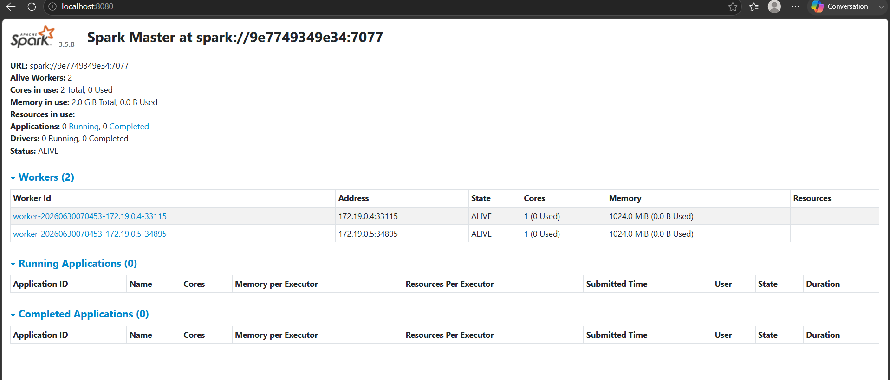
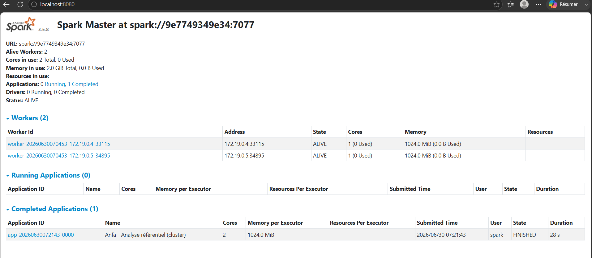
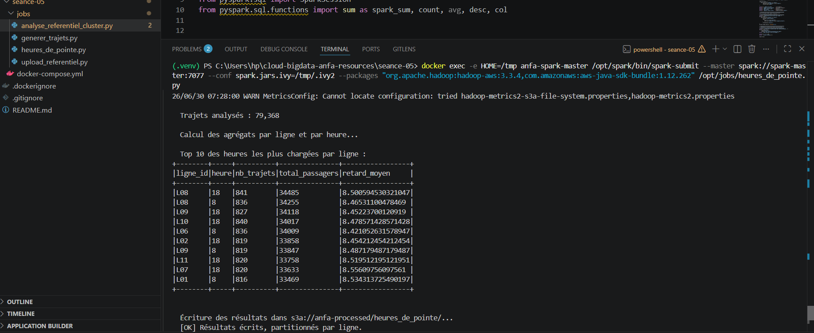
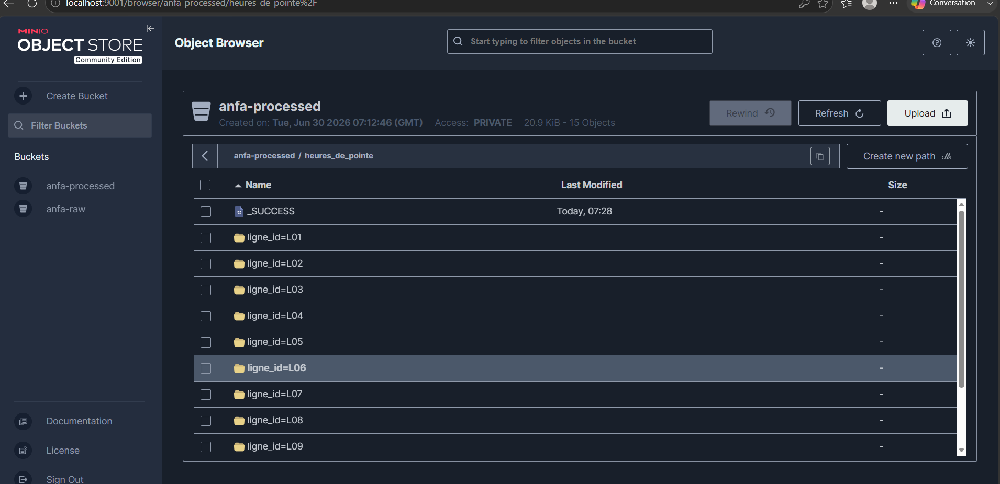

# Rendu Séance 5

**Nom et prénom :** BANIZI Gnimdou David

## Résumé de la séance
Déploiement d'un cluster Spark standalone (1 master + 2 workers) via Docker Compose. Exécution
de deux jobs PySpark distribués lisant le référentiel Anfa et un historique de trajets simulé
depuis MinIO, avec calcul de statistiques et des heures de pointe. Résultats écrits en Parquet
dans la zone `anfa-processed` du data lake. Comparaison du mode local (séance 2) et du mode
cluster, puis tentative du bonus Spark sur Kubernetes via Kind et Spark Operator.

## Étapes principales
1. Déploiement du cluster Spark standalone (1 master + 2 workers) via Docker Compose.
2. Préparation de MinIO (buckets `anfa-raw` et `anfa-processed`, clé applicative) et upload du référentiel.
3. Premier job distribué (`analyse_referentiel_cluster.py`) : statistiques de base, exécuté sur le cluster.
4. Génération d'un historique simulé de 79 368 trajets et job d'analyse des heures de pointe.
5. Comparaison subjective entre mode local et mode cluster.
6. Tentative du bonus Spark sur Kubernetes (voir `bonus_spark_k8s.md`).

## Captures d'écran

### Dashboard Spark Master avec 2 workers

### Application Spark exécutée avec succès

### Résultats du Top 10 dans la console

### Bucket anfa-processed avec heures_de_pointe partitionné

## Réflexion : local vs cluster

Sur le job des heures de pointe (79 368 trajets), le mode cluster et le mode local n'ont montré
aucune différence de temps significative (28 secondes pour le job cluster), ce qui confirme
ce qu'annonçait le TP : sur ce volume, l'overhead du cluster (démarrage du driver, négociation
avec le master, allocation des executors, communication réseau entre nœuds) absorbe tout le
gain théorique du parallélisme. En mode local, Spark simule un mini-cluster dans un seul
processus sans aucune communication réseau, ce qui est mécaniquement plus rapide pour de
petits volumes.

Pour ce volume précis, le mode local reste préférable : plus simple à déboguer, démarrage
quasi instantané, pas d'infrastructure à maintenir. Le mode cluster est davantage un
investissement architectural qu'un outil de performance immédiate : le jour où Anfa traitera
des millions de trajets historiques, ou voudra faire tourner plusieurs jobs en parallèle, c'est
cette même configuration cluster qui scalera sans qu'il soit nécessaire de réécrire le code
métier — c'est la promesse de portabilité de PySpark, où seul le `.master()` change.

En synthèse : mode local pour le développement et les petits volumes, mode cluster dès qu'une
montée en charge est anticipée ou pour valider l'architecture cible avant la mise en production.

## Bonus Spark sur Kubernetes

Réalisé : partiellement. Voir le détail complet dans `bonus_spark_k8s.md`. L'infrastructure
(cluster Kind, Spark Operator via Helm, RBAC, ConfigMap, manifeste SparkApplication, connexion
réseau MinIO ↔ Kind) a été mise en place avec succès, mais l'exécution effective du job n'a
pas abouti : l'opérateur Spark a été déployé avec un filtre `--namespaces=default` qui l'a
empêché de prendre en charge la ressource `SparkApplication`, y compris après redéploiement
dans le namespace `default`. La cause précise a été identifiée via les logs du controller.

## Difficultés rencontrées
- Conflit de réseaux Docker entre le cluster Kind (`172.18.x.x`) et le stack Compose
  (`172.19.x.x`) : résolu en connectant le conteneur MinIO au réseau `kind` avec
  `docker network connect kind anfa-minio`.
- Le job soumis via Spark Operator n'a jamais été pris en charge par le controller : diagnostic
  effectué via `kubectl logs deployment/spark-operator-controller`, révélant un filtrage de
  namespace (`--namespaces=default`) côté opérateur. Tentative de correction par redéploiement
  dans `default`, sans succès dans le temps imparti. Documenté dans `bonus_spark_k8s.md`.