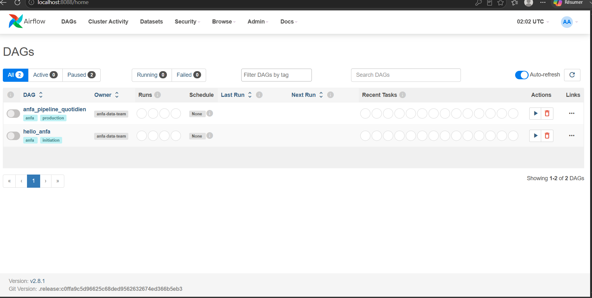
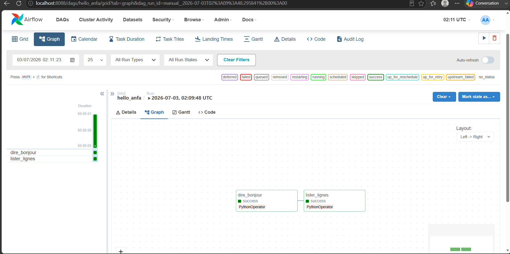
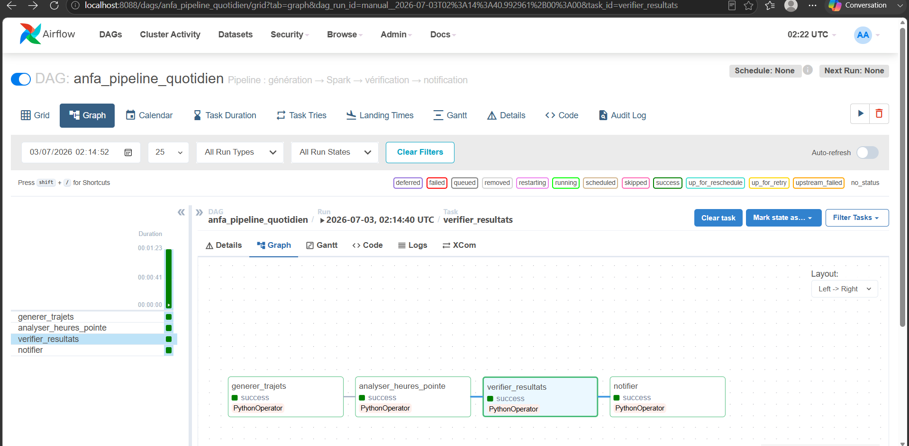
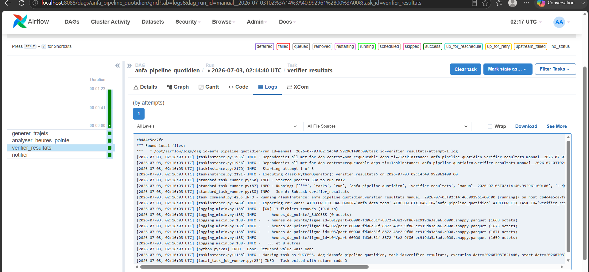
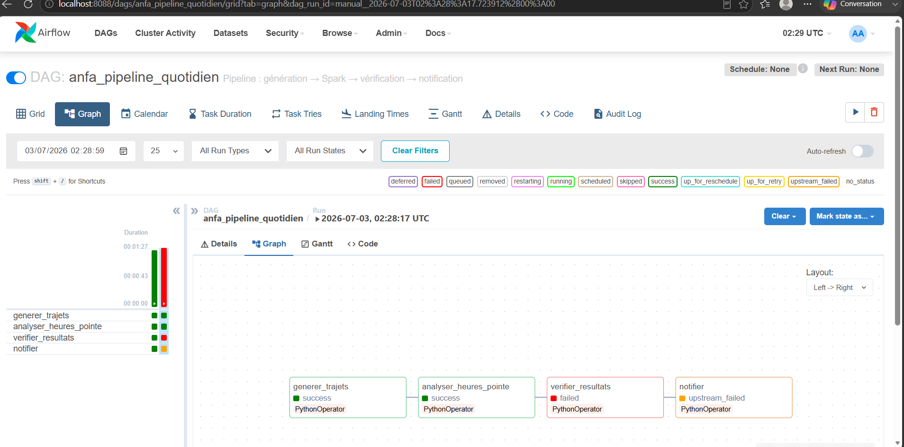

# Rendu : Séance 6

**Nom et prénom :** BANIZI Gnimdou David 
**Identifiant GitHub :** BANIZI
**Date de soumission :** 03/07/2026

## Résumé de la séance

Airflow déployé via Docker Compose aux côtés de MinIO et Spark. Un premier DAG
simple (`hello_anfa`) a servi à comprendre la mécanique, puis un DAG métier
(`anfa_pipeline_quotidien`) orchestre le pipeline de la séance 5 :
génération → analyse Spark → vérification → notification. Les retries et la
propagation d'échec ont été observés via un bug volontaire.

## Étapes principales

1. Déploiement de la stack (Airflow + PostgreSQL + MinIO + Spark) via Docker Compose.
2. Premier DAG `hello_anfa` à 2 tâches : initiation à la mécanique Airflow.
3. DAG métier `anfa_pipeline_quotidien` à 4 tâches : génération → Spark → vérification → notification.
4. Démonstration des retries et de la gestion d'erreur via un bug volontaire.

## Captures d'écran

### UI Airflow après connexion (vue d'accueil)

### DAG hello_anfa exécuté en succès

### DAG anfa_pipeline_quotidien complet en succès

### Logs de la tâche `verifier_resultats`

### Démonstration du retry : tâche en échec et propagation

## Réflexion personnelle

Contrairement à cron, Airflow permet d'enchaîner plusieurs tâches avec des
dépendances explicites, de relancer automatiquement une tâche en échec sans
tout rejouer depuis le début, et de visualiser l'état du pipeline (succès,
échec, durée) dans une interface graphique. Sur un vrai projet, Airflow
devient indispensable dès qu'un pipeline dépasse une seule commande isolée :
dès qu'il y a plusieurs étapes dépendantes (extraction, transformation,
chargement, notification), qu'on a besoin de rejouer une période passée
(backfill) après correction d'un bug, ou qu'on veut être alerté
automatiquement en cas d'échec sans surveiller manuellement.

## Difficultés rencontrées

Au premier démarrage de la stack, le conteneur `anfa-postgres` (image
`postgres:18-alpine`) restait bloqué en état "unhealthy" à cause d'un
changement de format de stockage introduit dans PostgreSQL 18 (incompatible
avec le point de montage `/var/lib/postgresql/data` utilisé dans le
docker-compose.yml). La solution a été de revenir à une image plus stable,
`postgres:16-alpine`, après quoi la stack a démarré normalement.
