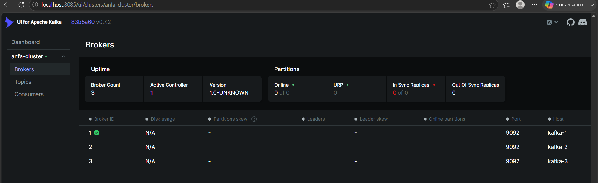
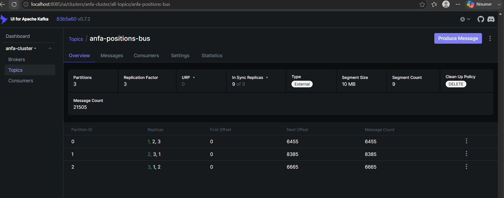
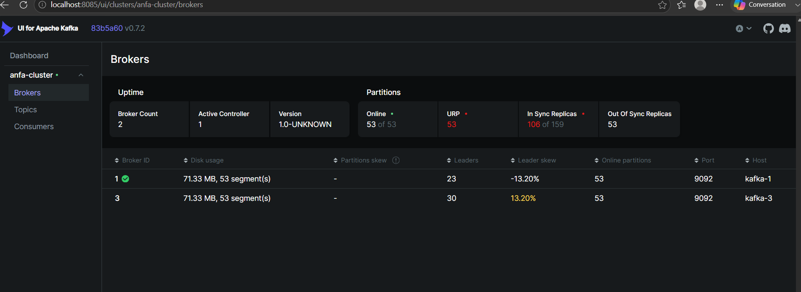
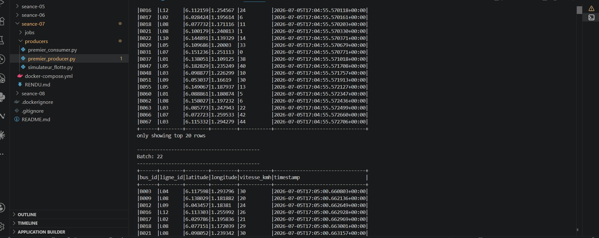
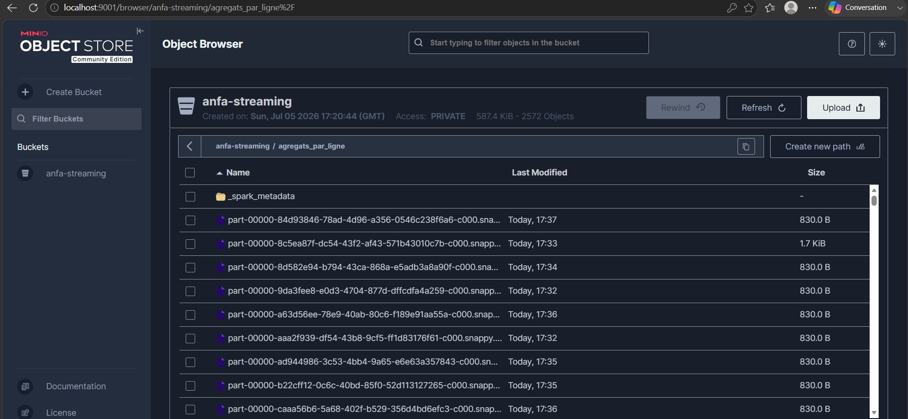

# Rendu — Séance 7

**Nom et prénom :** BANIZI Gnimdou David
**Identifiant GitHub :** BANIZI
**Date de soumission :** 05/07/2026

## Résumé de la séance

Déploiement d'un cluster Kafka à 3 brokers en mode KRaft (sans Zookeeper), accompagné de Kafka UI pour l'observation. Création du topic `anfa-positions-bus` (3 partitions, réplication 3) et simulation d'une flotte de 100 bus Anfa envoyant leur position GPS en continu (~100 messages/seconde). Démonstration concrète de la tolérance aux pannes en tuant un broker volontairement, sans interruption de service. Consommation du flux avec Spark Structured Streaming, d'abord en mode console pour validation, puis avec agrégation en fenêtres temporelles de 30 secondes (nombre de bus actifs et vitesse moyenne par ligne), écrite en continu dans MinIO au format Parquet.

## Étapes principales

1. Déploiement du cluster Kafka (3 brokers, mode KRaft) + Kafka UI.
2. Création du topic `anfa-positions-bus` (3 partitions, réplication 3).
3. Premier producer/consumer Python pour comprendre la mécanique.
4. Simulation de 100 bus envoyant leur position en continu.
5. Démonstration de tolérance aux pannes (arrêt d'un broker).
6. Spark Structured Streaming : lecture console, puis agrégation en fenêtre vers MinIO.

## Captures d'écran

### 3 brokers actifs dans Kafka UI

### Débit de messages en augmentation

### Cluster avec 2 brokers sur 3 (après arrêt volontaire)

### Micro-batchs affichés en console par Spark

### Résultats agrégés dans MinIO

## Réflexion personnelle

Kafka + Spark Streaming s'impose quand la valeur de la donnée dépend de sa fraîcheur : suivre une flotte de bus en temps réel, détecter une anomalie de vitesse ou un retard dès qu'il se produit, alimenter un tableau de bord live. Le pipeline batch Airflow + Spark (séance 5-6) reste préférable pour des traitements périodiques et volumineux où la latence importe peu (rapports quotidiens, agrégations historiques, ré-entraînement de modèles). La réplication à 3 brokers m'a montré très concrètement, et pas seulement en théorie, qu'un cluster distribué peut absorber la panne d'un nœud sans aucune perte de données ni interruption : en tuant `kafka-2` en pleine ingestion, le simulateur a continué d'envoyer sans la moindre erreur, et Kafka a automatiquement basculé le leadership des partitions concernées vers les brokers restants.

## Réponses aux exercices d'application

## Difficultés rencontrées

Lors du lancement du job Spark d'agrégation, celui-ci restait bloqué en état `WAITING` sans jamais démarrer. Diagnostic via l'UI Spark Master (`localhost:8091`) : le worker ne disposait que d'un seul core, déjà occupé par le job de lecture console précédent, resté actif en arrière-plan. La cause : la commande `docker exec` avait été lancée sans l'option `-it`, si bien que le `Ctrl+C` n'avait interrompu que l'affichage des logs côté terminal, sans tuer le vrai processus Spark dans le conteneur. Solution : redémarrage des conteneurs Spark (`docker restart anfa-spark-master anfa-spark-worker`) pour libérer le core, puis relance des `spark-submit` suivants avec l'option `-it` afin que l'interruption soit correctement transmise au processus.