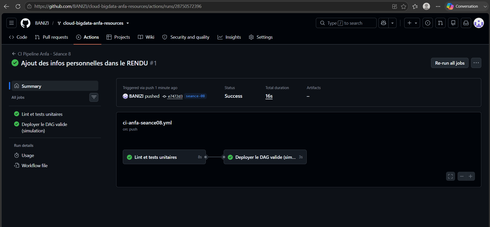
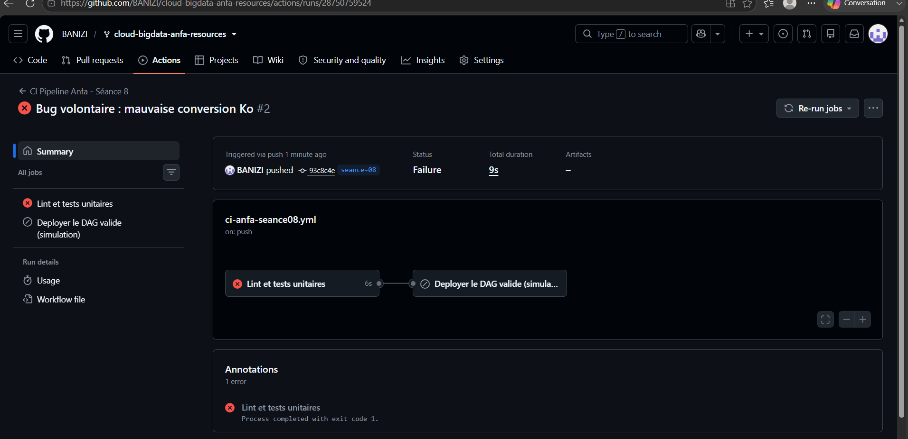

# Rendu — Séance 8

**Nom et prénom :** BANIZI Gnimdou David
**Identifiant GitHub :** BANIZI
**Date de soumission :** 05/07/2026

## Résumé de la séance

La logique métier du DAG Airflow de la séance 6 a été extraite dans un module Python pur (`anfa_logic.py`), testable sans installer Airflow. Cinq tests unitaires ont été écrits avec pytest pour couvrir cette logique. Un workflow GitHub Actions a ensuite été mis en place pour exécuter automatiquement le lint et les tests à chaque push, suivi d'un job de déploiement simulé qui ne s'exécute que si les tests passent. Un bug volontaire a permis de démontrer concrètement que le pipeline bloque le déploiement en cas de test en échec, avant de corriger le bug et de revalider le pipeline.

## Étapes principales

1. Séparation de la logique métier (`anfa_logic.py`) du DAG Airflow.
2. Écriture de 5 tests unitaires avec pytest.
3. Écriture du workflow GitHub Actions (lint + tests + déploiement simulé).
4. Démonstration : un bug volontaire bloque le déploiement ; correction et succès.

## Captures d'écran

### Workflow réussi (2 jobs)

### Job en échec, déploiement non exécuté

## Réflexion personnelle

Ce pipeline aurait empêché l'incident de Mawuli en interceptant automatiquement le bug avant qu'il n'atteigne la production : dès qu'un test unitaire échoue, le job `valider-dag` passe en échec et le job `deployer` ne se déclenche jamais, grâce à la dépendance `needs: valider-dag`. Sans CI, ce type d'erreur de calcul silencieuse (comme la division par 1000 au lieu de 1024) ne serait détecté qu'en observant des résultats incohérents en production, potentiellement bien après le déploiement. Le mot-clé `needs:` change concrètement la donnée en imposant un ordre d'exécution strict entre jobs : il transforme une simple suite de vérifications indépendantes en une véritable porte de qualité (quality gate) qui conditionne le droit de déployer.

## Difficultés rencontrées

Aucune difficulté majeure. Le seul point d'attention a été de constater que le premier push vers la nouvelle branche `seance-08` (contenant des fichiers déjà présents suite à un merge antérieur) n'a pas déclenché le workflow, car aucun changement n'avait été détecté dans le chemin `seance-08/**`. Un commit modifiant réellement un fichier du dossier a suffi à déclencher le pipeline normalement.