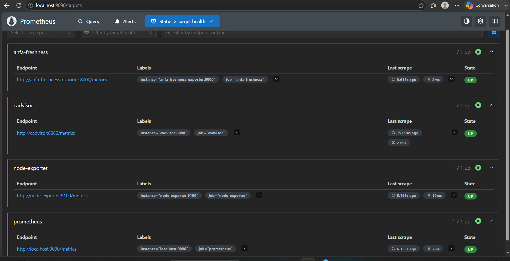
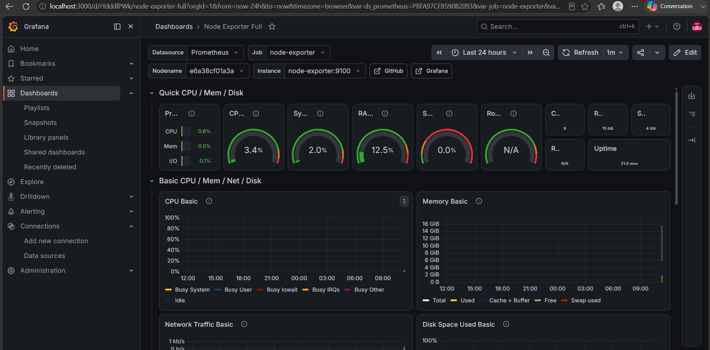
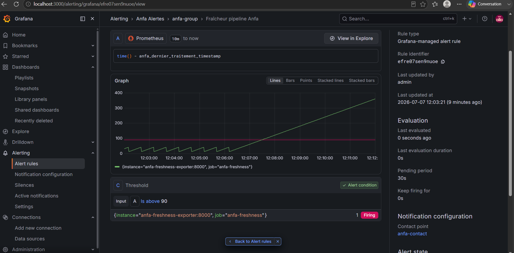

# Rendu — Séance 9

**Nom et prénom :** BANIZI Gnimdou David
**Identifiant GitHub :** BANIZI
**Date de soumission :** 07/07/2026

## Résumé de la séance

<2-4 lignes : stack Prometheus/Grafana déployée, exportateur de fraîcheur Anfa
instrumenté, dashboard construit, alerte configurée et déclenchée sur panne simulée.>

## Étapes principales

1. Déploiement de Prometheus, Node Exporter, cAdvisor, Grafana et d'un exportateur
   métier custom (fraîcheur des données Anfa).
2. Exploration des cibles Prometheus et premières requêtes PromQL.
3. Import du dashboard "Node Exporter Full" et construction d'un panneau custom.
4. Configuration d'une alerte Grafana sur la fraîcheur des données.
5. Simulation d'une panne silencieuse et observation du déclenchement de l'alerte.

## Captures d'écran

### Les 4 cibles Prometheus à l'état UP

### Dashboard "Node Exporter Full" importé

### Alerte à l'état Firing après panne simulée

## Réflexion personnelle

Cette séance répond directement à la situation-problème d'Awa : rien n'avait techniquement planté (pods `Running`, DAG `success`), mais le pipeline avait traité un fichier vide, un succès technique masquant un échec métier. La métrique de fraîcheur simulée ici illustre le même principe : l'exportateur reste actif et sans erreur, mais cesse de produire un résultat utile — ce que ni `docker compose ps` ni les métriques CPU/RAM ne peuvent révéler. C'est exactement l'apport de l'observabilité par rapport au simple monitoring d'infrastructure : détecter en quelques secondes ce qu'Awa a mis 30 minutes à trouver, avant même qu'un utilisateur ne s'en aperçoive.

## Difficultés rencontrées

<Aucune | Décrivez brièvement.>
