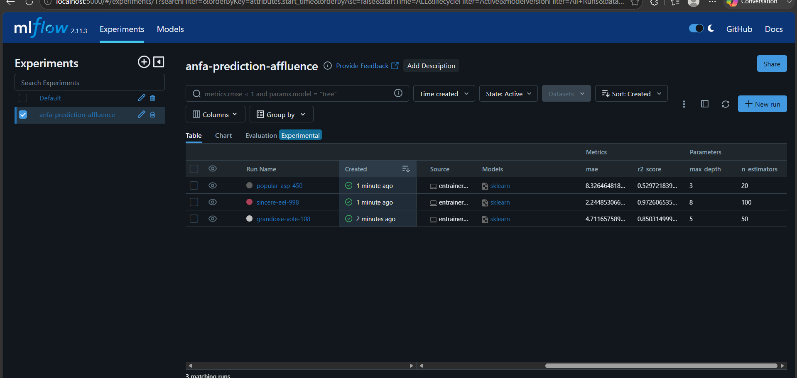
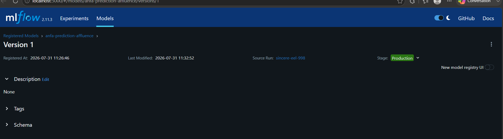

# Rendu — Séance 10

**Nom et prénom :** BANIZI Gnimdou David
**Identifiant GitHub :** BANIZI
**Date de soumission :** 31/07/2026

## Résumé de la séance

<2-4 lignes : serveur MLflow déployé, 3 runs d'entraînement tracés et comparés,
meilleur modèle enregistré en Production dans le Registry, fiche de conformité rédigée.>

## Étapes principales

1. Déploiement d'un serveur MLflow Tracking (SQLite + stockage local).
2. Génération d'un jeu de données d'affluence Anfa et entraînement de 3 variantes
   d'un modèle RandomForest, chacune tracée avec MLflow.
3. Comparaison des runs dans l'UI et identification du meilleur candidat.
4. Enregistrement du modèle dans le Model Registry, transition en statut Production.
5. Rédaction d'une fiche de conformité pour un scénario d'application mobile Anfa.

## Captures d'écran

### Tableau des 3 runs comparés

### Modèle enregistré en statut Production

## Réflexion personnelle

Le Model Registry résout directement le problème de Kossi : au lieu de notebooks dispersés dont personne ne sait quelle version tourne réellement, le Registry donne une source de vérité unique — "la version en Production" est identifiable sans ambiguïté, et un script applicatif peut la charger sans connaître son numéro de run. C'est exactement le même principe que le versionnement d'infrastructure vu en séance 4 avec Terraform : le `terraform.tfstate` sert de source de vérité sur l'état réel de l'infrastructure, tout comme le Registry sert de source de vérité sur quel modèle est actif. Dans les deux cas, on remplace la mémoire humaine ("je crois que c'est cette version") par une trace fiable et consultable par toute l'équipe.

## Difficultés rencontrées

Mon environnement Python par défaut utilisait la version 3.13, incompatible avec certaines dépendances de MLflow (notamment numpy<2, qui nécessite une compilation impossible sans compilateur C sous Windows). J'ai résolu ce problème en installant Python 3.11 et en créant un environnement virtuel dédié à cette séance.
